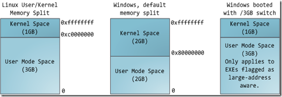
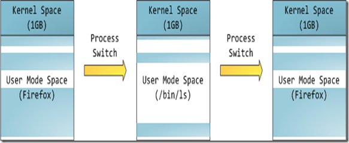
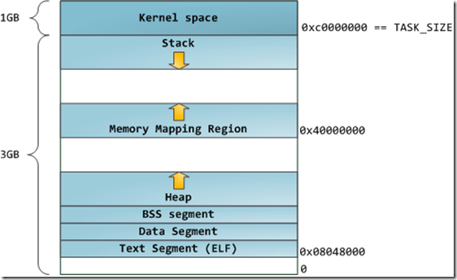
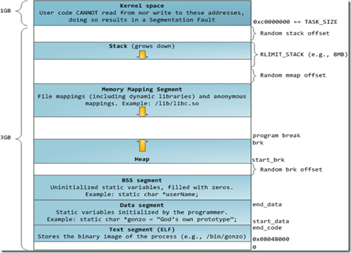
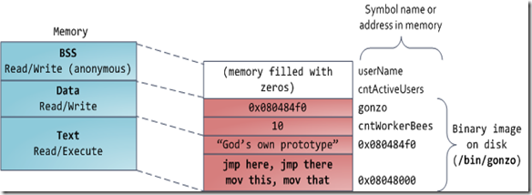
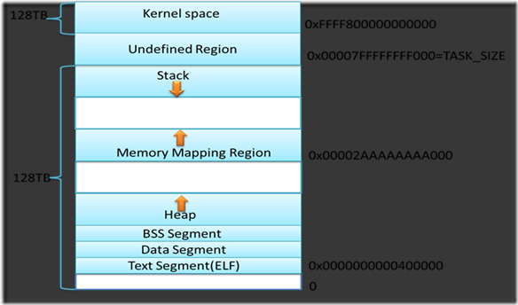

# 内存地址空间布局

在多任务操作系统中的每一个进程都运行在一个属于它自己的内存沙盘中。这个沙盘就是虚拟地址空间（virtual address space）。

#### 32位虚拟内存布局

在32位模式下虚拟地址空间总是一个4GB的内存地址块。这些虚拟地址通过页表（page table）映射到物理内存，页表由操作系统维护并被处理器引用。每一个进程拥有一套属于它自己的页表，但是还有一个隐情。只要虚拟地址被使用，那么它就会作用于这台机器上运行的所有软件，包括内核本身。因此一部分虚拟地址必须保留给内核使用：

这并不意味着内核使用了那么多的物理内存，仅表示它可支配这么大的地址空间，可根据内核需要，将其映射到物理内存。内核空间在页表中拥有较高的特权级（ring 2或以下），因此只要用户态的程序试图访问这些页，就会导致一个页错误（page fault），用户程序不可访问内核页。在Linux中，内核空间是持续存在的，并且在所有进程中都映射到同样的物理内存。内核代码和数据总是可寻址的，随时准备处理中断和系统调用。与此相反，用户模式地址空间的映射随进程切换的发生而不断变化：

图2中，蓝色区域表示映射到物理内存的虚拟地址，而白色区域表示未映射的部分。在上面的例子中，Firefox使用了相当多的虚拟地址空间，因为它是传说中的吃内存大户。地址空间中的各个条带对应于不同的内存段（memory segment），如：堆、栈之类的。记住，这些段只是简单的内存地址范围，与Intel处理器的段没有关系。

###### 32位经典布局

32位经典内存布局，程序起始1GB地址为内核空间，接下来是向下增长的栈空间和由0×40000000向上增长的mmap地址。而堆地址是从底部开始，去除ELF、代码段、数据段、常量段之后的地址并向上增长。但是这种布局有几个问题，首先是容易遭受溢出攻击；其次是，堆地址空间只有不到1G有木有？如果mmap内存比较少地址很浪费有木有？所以后来就有了另一种内存布局

###### 32位默认内存布局

当计算机开心、安全、可爱、正常的运转时，几乎每一个进程的各个段的起始虚拟地址都与图4完全一致，这也给远程发掘程序安全漏洞打开了方便之门。一个发掘过程往往需要引用绝对内存地址：栈地址，库函数地址等。远程攻击者必须依赖地址空间布局的一致性，摸索着选择这些地址。如果让他们猜个正着，有人就会被整了。因此，地址空间的随机排布方式逐渐流行起来。Linux通过对栈、内存映射段、堆的起始地址加上随机的偏移量来打乱布局。不幸的是，32位地址空间相当紧凑，给随机化所留下的空当不大，削弱了这种技巧的效果。

栈
进程地址空间中最顶部的段是栈，大多数编程语言将之用于存储局部变量和函数参数。调用一个方法或函数会将一个新的栈桢（stack frame）压入栈中。栈桢在函数返回时被清理。也许是因为数据严格的遵从LIFO的顺序，这个简单的设计意味着不必使用复杂的数据结构来追踪栈的内容，只需要一个简单的指针指向栈的顶端即可。因此压栈（pushing）和退栈（popping）过程非常迅速、准确。另外，持续的重用栈空间有助于使活跃的栈内存保持在CPU缓存中，从而加速访问。进程中的每一个线程都有属于自己的栈。

通过不断向栈中压入的数据，超出其容量就有会耗尽栈所对应的内存区域。这将触发一个页故障（page fault），并被Linux的expand_stack()处理，它会调用acct_stack_growth()来检查是否还有合适的地方用于栈的增长。如果栈的大小低于RLIMIT_STACK（通常是8MB），那么一般情况下栈会被加长，程序继续愉快的运行，感觉不到发生了什么事情。这是一种将栈扩展至所需大小的常规机制。然而，如果达到了最大的栈空间大小，就会栈溢出（stack overflow），程序收到一个段错误（Segmentation Fault）。当映射了的栈区域扩展到所需的大小后，它就不会再收缩回去，即使栈不那么满了。这就好比联邦预算，它总是在增长的。

动态栈增长是唯一一种访问未映射内存区域（图中白色区域）而被允许的情形。其它任何对未映射内存区域的访问都会触发页故障，从而导致段错误。一些被映射的区域是只读的，因此企图写这些区域也会导致段错误。

内存映射段
在栈的下方，是我们的内存映射段。此处，内核将文件的内容直接映射到内存。任何应用程序都可以通过Linux的mmap()系统调用（实现）或Windows的CreateFileMapping() / MapViewOfFile()请求这种映射。内存映射是一种方便高效的文件I/O方式，所以它被用于加载动态库。创建一个不对应于任何文件的匿名内存映射也是可能的，此方法用于存放程序的数据。在Linux中，如果你通过malloc()请求一大块内存，C运行库将会创建这样一个匿名映射而不是使用堆内存。‘大块’意味着比MMAP_THRESHOLD还大，缺省是128KB，可以通过mallopt()调整。

堆
说到堆，它是接下来的一块地址空间。与栈一样，堆用于运行时内存分配；但不同点是，堆用于存储那些生存期与函数调用无关的数据。大部分语言都提供了堆管理功能。因此，满足内存请求就成了语言运行时库及内核共同的任务。在C语言中，堆分配的接口是malloc()系列函数，而在具有垃圾收集功能的语言（如C#）中，此接口是new关键字。

如果堆中有足够的空间来满足内存请求，它就可以被语言运行时库处理而不需要内核参与。否则，堆会被扩大，通过brk()系统调用（实现）来分配请求所需的内存块。堆管理是很复杂的，需要精细的算法，应付我们程序中杂乱的分配模式，优化速度和内存使用效率。处理一个堆请求所需的时间会大幅度的变动。实时系统通过特殊目的分配器来解决这个问题。堆也可能会变得零零碎碎，如下图所示：

BSS 数据段 代码段
最后，我们来看看最底部的内存段：BSS，数据段，代码段。在C语言中，BSS和数据段保存的都是静态（全局）变量的内容。区别在于BSS保存的是未被初始化的静态变量内容，它们的值不是直接在程序的源代码中设定的。BSS内存区域是匿名的：它不映射到任何文件。如果你写static int cntActiveUsers，则cntActiveUsers的内容就会保存在BSS中。

另一方面，数据段保存在源代码中已经初始化了的静态变量内容。这个内存区域不是匿名的。它映射了一部分的程序二进制镜像，也就是源代码中指定了初始值的静态变量。所以，如果你写static int cntWorkerBees = 10，则cntWorkerBees的内容就保存在数据段中了，而且初始值为10。尽管数据段映射了一个文件，但它是一个私有内存映射，这意味着更改此处的内存不会影响到被映射的文件。也必须如此，否则给全局变量赋值将会改动你硬盘上的二进制镜像，这是不可想象的。

下图中数据段的例子更加复杂，因为它用了一个指针。在此情况下，指针gonzo（4字节内存地址）本身的值保存在数据段中。而它所指向的实际字符串则不在这里。这个字符串保存在代码段中，代码段是只读的，保存了你全部的代码外加零零碎碎的东西，比如字符串字面值。代码段将你的二进制文件也映射到了内存中，但对此区域的写操作都会使你的程序收到段错误。这有助于防范指针错误，虽然不像在C语言编程时就注意防范来得那么有效。下图展示了这些段以及我们例子中的变量：

你可以通过阅读文件/proc/pid_of_process/maps来检验一个Linux进程中的内存区域。记住一个段可能包含许多区域。比如，每个内存映射文件在mmap段中都有属于自己的区域，动态库拥有类似BSS和数据段的额外区域。下一篇文章讲说明这些“区域”（area）的真正含义。有时人们提到“数据段”，指的就是全部的数据段+ BSS + 堆。

#### 64位虚拟内存布局
64位系统的寻址空间比较大，所以仍然沿用了32位的经典布局，但是加上了随机的mmap起始地址，以防止溢出攻击。反正一时半会是用不了这么大的内存地址了，所以至少N多年不会变了。

首先, 目前大部分的操作系统和应用程序并不需要16EB( 264 )如此巨大的地址空间, 实现64位长的地址只会增加系统的复杂度和地址转换的成本, 带不来任何好处. 所以目前的x86-64架构CPU都遵循AMD的Canonical form, 即只有虚拟地址的最低48位才会在地址转换时被使用, 且任何虚拟地址的48位至63位必须与47位一致(sign extension). 也就是说, 总的虚拟地址空间为256TB( 248 ).

然后, 在这256TB的虚拟内存空间中, 0000000000000000 - 00007fffffffffff(128TB)为用户空间, ffff800000000000 - ffffffffffffffff(128TB)为内核空间. 这里需要注意的是, 内核空间中有很多空洞, 越过第一个空洞后, ffff880000000000 - ffffc7ffffffffff(64TB)才是直接映射物理内存的区域, 也就是说默认的PAGE_OFFSET为ffff880000000000. 从这里我们也可以看出, 这么大的直接映射区域足够映射所有的物理内存, 所以目前x86-64架构下是不存在高端内存, 也就是ZONE_HIGHMEM这个区域的(参考上篇)